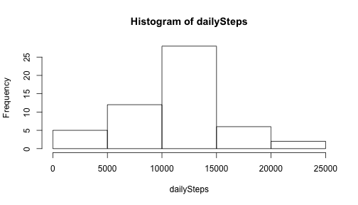
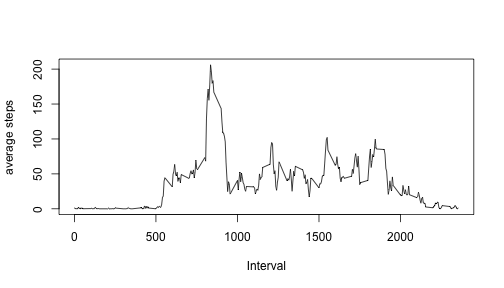
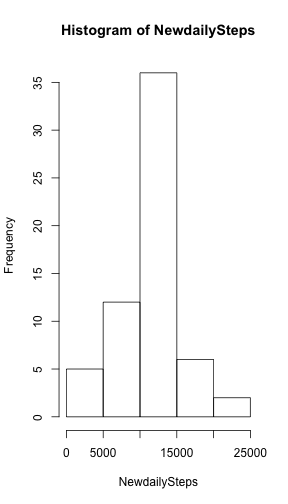
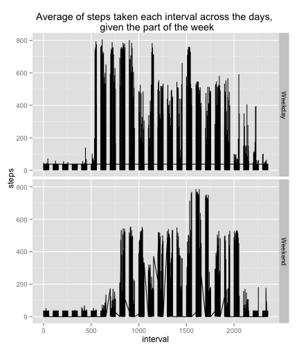

##Loading and preprocessing the data
1. Load the data (i.e. read.csv())
2. Process/transform the data (if necessary) into a format suitable for your analysis


```r
library(plyr)
Mydata <- read.csv("activity.csv")

cases<-data.frame(Mydata$steps,as.Date(Mydata$date),Mydata$interval)
names(cases)<-c("steps","date","interval")

completeCases <- cases[complete.cases(cases),]
names(completeCases)<-c("steps","date","interval")

daily_sum <- aggregate(completeCases$steps ~ completeCases$date, data=completeCases, sum)
daily_mean <- aggregate(completeCases$steps ~ completeCases$date, data=completeCases, mean)
daily_median <- aggregate(completeCases$steps ~ completeCases$date, data=completeCases, median)
dailySteps <- daily_sum[["completeCases$steps"]]

activity_interval <- aggregate(formula= steps~interval,data=cases,FUN=mean,na.rm=TRUE)
```

Total number of steps taken each day 


```r
hist(dailySteps,)
```

 

Mean number of steps taken per day


```r
mean(daily_sum[["completeCases$steps"]] )
```

```
## [1] 10766.19
```

Median total number of steps taken per day


```r
median(daily_sum[["completeCases$steps"]] )
```

```
## [1] 10765
```

Make a time series x = 5 minute and y= average across all days
        

```r
intervalmean<-aggregate(steps~interval,completeCases,mean)
plot(intervalmean$interval,intervalmean$steps,type="l",xlab="Interval", ylab="average steps")
```

 

Which 5 minute interval on average contains the maximum steps


```r
max(intervalmean$steps)
```

```
## [1] 206.1698
```
Imputing Missing Values
Total number of missing values in the dataset (i.e. the total number of rows with NAs)

```r
nrow(cases) - nrow(completeCases)
```

```
## [1] 2304
```
Strategy for filling in all of the missing values in the dataset - Let's use the mean of completeCases and fill the NA

```r
Newcase<-cases
Newcase[is.na(Newcase)] <- 37.38
```


Histogram of total no.of steps/day


```r
Newdaily_sum <- aggregate(Newcase$steps ~ Newcase$date, data=Newcase, sum)
NewdailySteps <- Newdaily_sum[["Newcase$steps"]]
hist(NewdailySteps)
```

 
Find mean and median total number of steps taken per day 


```r
mean(NewdailySteps)
```

```
## [1] 10766.09
```

```r
median(NewdailySteps)
```

```
## [1] 10765.44
```
The impact of imputing missing data on the estimates of the total daily number of steps?

## There is a higher frequency of days with more steps,as we replaced NA's with mean value

Add a column to data table to indicate weekday/weekend

```r
Newcase$week<-ifelse(weekdays(Newcase$date)!="Saturday"& weekdays(Newcase$date)!="Sunday","Weekday","Weekend")
```

Plot over Weekdays,Weekends


```r
library(ggplot2)
qplot(interval,steps,data=Newcase,facets=week~.,binwidth=2,geom = "line")+ labs(title='Average of steps taken each interval across the days, \n given the part of the week')
```

 


